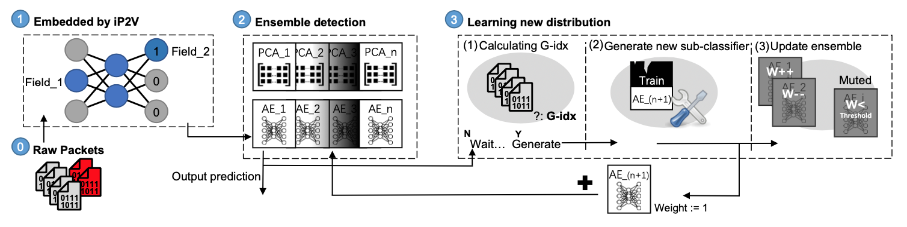

**ENIDrift**
[![GitHub license][license-badge]](LICENSE)
[![Discord Chat][discord-badge]][discord]
==

**ENIDrift** is a fast and adaptive **E**nsemble system for **N**etwork **I**ntrusion **D**etection under real world **Drift**. The technique design of this work is introduced in this [updated paper](https://github.com/AnonymousGithubRepo/ENIDrift/blob/main/ENIDrift.pdf). In this repo, we provide the [code of ENIDrift](https://github.com/AnonymousGithubRepo/ENIDrift/tree/main/ENIDrift), and also open-source the first real-world drift dataset for network intrusion detection, [RWDIDS-2022](https://github.com/AnonymousGithubRepo/ENIDrift/tree/main/RWDIDS).

## What is ENIDrift?
Machine Learning (ML) techniques have been widely applied for network intrusion detection. However, existing ML-based network intrusion detection systems (NIDS) suffer from fundamental limitations that hinder them from being deployed in the real world. They consider a narrow scope rather than real-world drift that involves dynamically distributed network packets and well-crafted ML attacks. Besides, they pose high runtime overhead and have low processing speed.

In this work, we solve the limitations and design ENIDrift, a fast and adaptive ensemble system for real-world network intrusion detection. ENIDrift employs iP2V, a novel incremental feature extraction method based on network packet fields, which adopts a simple three-layer neural network with relatively lightweight computation and achieves high efficiency. ENIDrift uses a robust sub-classifier generation module that constructs new sub-classifiers based on the stability and accuracy of incoming data chunks, and its training time is also reduced from O(n) to O(1).



We show the workflow of ENIDrift in the above figure. At the initial stage, raw packets will be captured by external programs (e.g., WireShark). Then the data will be sent to our system continuously. The later three parts in the figure are where the main body of ENIDrift lies:
* **iP2V embedding.** ENIDrift provides an incremental packet-to-vector tool, iP2V, deployed to extract features from raw network packets. The extraction results will be sent for the following ensemble detection.
* **Ensemble detection.** The ensemble model of ENIDrift consists of several sub-classifiers and ENIDrift will output the weighted predictions as its final detection result. Meanwhile, the incoming data will also be copied to sub-classifier generation module for further training.
* **Learning new distribution.** Sub-classifier generation module and ENIDrift update module involve in the stage. They will help find the right training data chunk based on our G-idx and adjust the ensemble model.

Compared to other work, ENIDrift has:
1. **Novel techniques and system.** We develop a new NIDS, ENIDrift with several new techniques: 1) iP2V that incrementally embeds relevant network packets into similar vectors and has good performance and efficiency for NIDS tasks; 2) G-idx that measures both stability and accuracy of current data chunk for a more robust sub-classifier generation; 3) ENIDrift update module that improves the adjustment of sub-classifier weights and data chunk management.
2. **New open-sourced dataset with real-world drift.** We spent considerable effort constructing a new dataset considering real-world settings and fierce drift caused by concept drift, imbalanced data, and well-crafted ML attack.
3. **Readily deployable performance.** Our evaluation results demonstrate that ENIDrift has good performance on both accuracy and processing speed, and is sufficient for real-world deployment even under inadequate and delayed training data.

## Prerequisites
1. Pre-process for network packets.

      For privacy issues, only key network fields are kept in our dataset in the form of .csv files. Accordingly, the input for ENIDrift is .csv files containing the string-type fields of network packets. If you want to run on your own .pcap file, we suggest utilizing our [python script]() to convert .pcap to .csv file first.

2. Software configuration:
  * Python 3.8.5
  * scikit-learn 0.23.2
  * tensorflow 2.4.1
  * scapy 2.4.3
## Getting started
1. Download the source code:
```sh
$ git clone https://github.com/AnonymousGithubRepo/ENIDrift
```

2. Run ENIDrift:
```sh
.
```

## Advanced functions
1. Model save:

2. Model load:

3. Control the speed of the release of training data:

# License
This project is licensed under the MIT License - see the LICENSE file for details

## Documentation
See [the paper](https://github.com/AnonymousGithubRepo/ENIDrift/blob/main/ENIDrift.pdf) for details on ENIDrift concepts and configuration.

## Community & help
* Got a question? Please get in touch via [Discord][discord] or file an [issue](https://github.com/anonymousgithubrepo/enidrift/issues).
* If you see an error message or run into an issue, please make sure to create a [bug report](https://github.com/anonymousgithubrepo/enidrift/issues).

## Contribute

<!-- refs -->
[license-badge]: https://img.shields.io/github/license/anonymousgithubrepo/enidrift
[discord]: https://discord.gg/BeVM624n
[discord-badge]: https://img.shields.io/badge/chat-on%20Discord-blue
